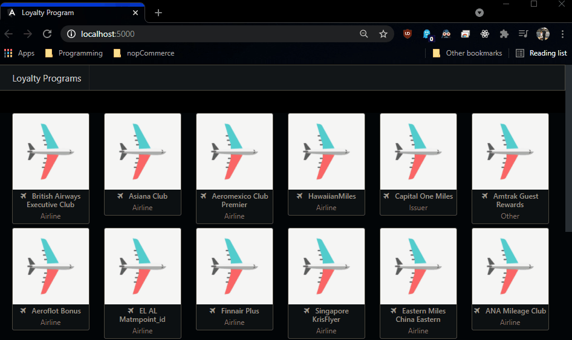

# Loyalty Programs App!
## Screenshots
 Included in Screenshots folder.
 
## Demo of usage

## Description
 Search Loyalty Programs and compare Points value. 

## Installation through Visual Studio Code
 0. Ensure you have Dotnet Core 5 sdk and runtime!
 1. Download repo as Zip
 2. Open Project in Visual Studio Code
 3. You can build Docker image and load to container from 
  *  docker build -t loyaltyprogram-app .*
  *  docker run -d -p 5000:80 loyaltyprogram-app*
 4. You can also run from within API folder through command prompt command "dotnet run"
 5. Site is accessible from https://localhost:5001/
 
## Project Status
 Complete for version 1.
 
## License
 [MIT](https://choosealicense.com/licenses/mit/)
